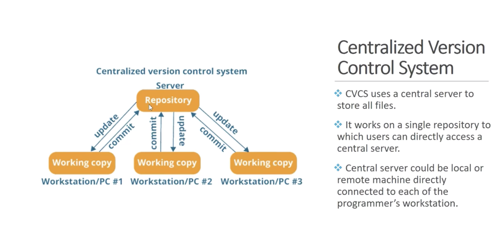
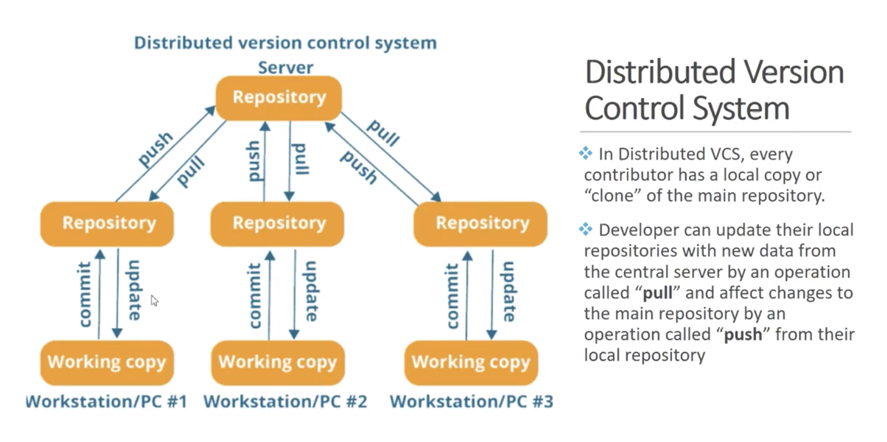

# GIT

**GIT - WORKFLOW - Three stages of GIT:**
* Working ditectory  (Untracked files: new files exists, but is not part of GIT (no add .)
* Stagig Area - pre commit holding area  (file added to git - add . but not committed yes)
* Committed: (the change has been committed)

#

* Centralised Version Control System - CVCS
* Distributed Version Control System - DVCS



Drowbacks of CVCS:
- locally is not available
- If central server is crashed - we can lose everything



# 
**Set Configuration parameters**

```
# git config --global user.name "AndreHoch"

# git config --global user.email "andrzej.hochbaum@gmail.com"

# git config --list
user.name=AndreHoch
user.email=andrzej.hochbaum@gmail.com


# cat  $HOME/.gitconfig
[user]
        name = AndreHoch
        email = andrzej.hochbaum@gmail.com

```
#


**GIT init**
git-init - Create an empty Git repository or reinitialize an existing one

```
# git init
Initialized empty Git repository in /Repos/.git/

# ls -la
total 0
drwxr-xr-x   3 root root  18 Feb 24 11:28 .
dr-xr-xr-x. 20 root root 273 Feb 24 11:00 ..
drwxr-xr-x   7 root root 119 Feb 24 11:28 .git
# cd .git
# ls -la
total 12
drwxr-xr-x 7 root root 119 Feb 24 11:28 .
drwxr-xr-x 3 root root  18 Feb 24 11:28 ..
drwxr-xr-x 2 root root   6 Feb 24 11:28 branches
-rw-r--r-- 1 root root  92 Feb 24 11:28 config
-rw-r--r-- 1 root root  73 Feb 24 11:28 description
-rw-r--r-- 1 root root  23 Feb 24 11:28 HEAD
drwxr-xr-x 2 root root 242 Feb 24 11:28 hooks
drwxr-xr-x 2 root root  21 Feb 24 11:28 info
drwxr-xr-x 4 root root  30 Feb 24 11:28 objects
drwxr-xr-x 4 root root  31 Feb 24 11:28 ref
```
#

**git status**
git-status - Show the working tree status
```
# git status
# On branch master
#
# Initial commit
#
nothing to commit (create/copy files and use "git add" to track)

# touch jeden.txt
# git status
# On branch master
#
# Initial commit
#
# Untracked files:
#   (use "git add <file>..." to include in what will be committed)
#
#       jeden.txt
nothing added to commit but untracked files present (use "git add" to track)

```
#


**git add**
 git-add - Add file contents to the index
 
 ```
 
# git add jeden.txt

# git status
# On branch master
#
# Initial commit
#
# Changes to be committed:
#   (use "git rm --cached <file>..." to unstage)
#
#       new file:   jeden.txt
#
```
or git add . (for all)

#

**git-commit - Record changes to the repository**

```
# vi jeden.txt
# git add .
# git comit -m "three"
git: 'comit' is not a git command. See 'git --help'.

Did you mean this?
        commit
# git commit -m "three"
[master 9cd3aa5] three
 1 file changed, 1 insertion(+)


```
#

**git-log - Show commit logs**

```
# git log
commit 9cd3aa599e8f0500e94532f455c968b37193b1b5
Author: AndreHoch <andrzej.hochbaum@gmail.com>
Date:   Sun Feb 24 11:44:02 2019 +0100

    three

commit d962a2eb9966ecd138487bc44f7bb421a05ded85
Author: AndreHoch <andrzej.hochbaum@gmail.com>
Date:   Sun Feb 24 11:43:02 2019 +0100

    second update

commit 4638ac2bd2cc9c1e70bd283f0a41f215e6bd9899
Author: AndreHoch <andrzej.hochbaum@gmail.com>
Date:   Sun Feb 24 11:40:31 2019 +0100

    my first commit

```
Git log - sort by author 

```
# git log --author="AndreHoch"
commit 9cd3aa599e8f0500e94532f455c968b37193b1b5
Author: AndreHoch <andrzej.hochbaum@gmail.com>
Date:   Sun Feb 24 11:44:02 2019 +0100

    three

commit d962a2eb9966ecd138487bc44f7bb421a05ded85
Author: AndreHoch <andrzej.hochbaum@gmail.com>
Date:   Sun Feb 24 11:43:02 2019 +0100

    second update

commit 4638ac2bd2cc9c1e70bd283f0a41f215e6bd9899
Author: AndreHoch <andrzej.hochbaum@gmail.com>
Date:   Sun Feb 24 11:40:31 2019 +0100

    my first commit


```
# 

**git-diff - Show changes between commits, commit and working tree, etc**

,example:

```


# echo "four" >> jeden.txt

# git diif
git: 'diif' is not a git command. See 'git --help'.

Did you mean this?
        diff
# git diff
diff --git a/jeden.txt b/jeden.txt
index 1e22ad7..c5aaf54 100644
--- a/jeden.txt
+++ b/jeden.txt
@@ -1,3 +1,4 @@
 Ala ma kota
 To jest second update
 three
+four

```
