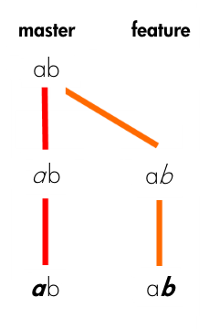
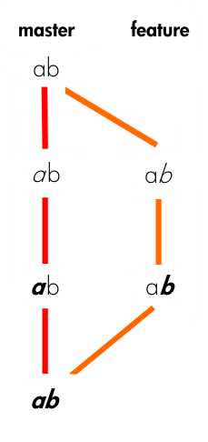
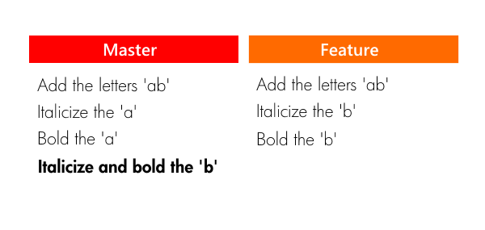
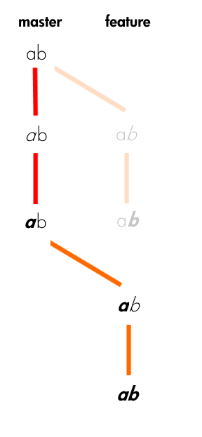

# Rebase  git-rebase - Reapply commits on top of another base tip


                     A---B---C topic
                    /
               D---E---F---G master

       From this point, the result of either of the following commands:

           git rebase master
           git rebase master topic

       would be:

                             A'--B'--C' topic
                            /
               D---E---F---G master


Another Example:

In our project’s Git repository, two branches currently exist: the usual master branch, and a feature branch that we created right after the initial commit. On the master branch, we have italicized the ‘a’, then bolded the ‘a’. On our feature branch, we have italicized the ‘b’, and then bolded the ‘b’.





**MERGE**

Merge
We believe our redesign of the letter ‘b’ is nothing short of a masterpiece, so we decide we want to bring our work back into the master branch, incorporating it into the actual project:

```
git checkout master
git merge feature
```




**REBASE**

At a high level, rebasing can be understood as “moving the base of a branch onto a different position”. Think of it like a redo — “I meant to start here.”

git checkout feature
git rebase master





